# **Next Hotel** 

#### Take You To The Next Level

This repository is the Capstone Project in [Bangkit Academy](https://grow.google/intl/id_id/bangkit/) 2022. This application is purpose to help user to get hotel recommendations.  
  
 
## Demo Video 

## Our Team
| Name                            | Bangkit-ID    | Path               |
| -------------                   | ------------- | -------------      |
| Abu Davi                        | M2002G0034    | Machine Learning   |
| Christell James Cellose         | M2003F0139    | Machine Learning   |
| Fatiha Agyal Shahwiya           | M2002G0032    | Machine Learning   |
| Muhammad Gusanwa Akbar          | M2441W3035    | Machine Learning   |
| Alvi Geovanny                   | C2213F1976    | Cloud Computing    |
| Fajar Fitrianto                 | C7194F1847    | Cloud Computing    |
| Kelvin                          | C2213G1975    | Cloud Computing    |
| Faiz Rofi Hencya                | A2012F1244    | Mobile Development |
| Fikky Ardianto                  | A7355G2901    | Mobile Development |
| Thoriq Harizul Ahsan            | A2441W3032    | Mobile Development |

# Application Install

***You can Install and test latest Next Hotel app from below 👇***

## Getting started
- Prerequisites
  - Android
  - Internet connection

- Installation
  - Download the APK
  - Install the APK

## Usage
- How to get hotel recommendations from user personalized
  - Open App
  - On survey page, choose your interest
  - In the Home Screen, "Hotel For You" Section is the recommendations.

- How to get Hotel ranking by general
  - Open App
  - In the Home Screen, "Best Pick" Section is the hotel ranking.

- How to find hotel
  - Open App
  - In the Home Screen, Click "Search View" fill keyword.
  - The result will show.

- How to share hotel
  - Open App
  - In the Home Screen, click hotel you want to share.
  - In the detail screen, click share button.
  - Share to your friend.

## Setup
Clone the repository on your machine. Open the project on your IDE and run it.

## About
- Hotel Recommendation Based on Your Personalized
- Hotel Best Pick
- Explore Hotels
- Clean and Simple Material UI
- Light Mode and Dark Mode 🌗

## MAD Score

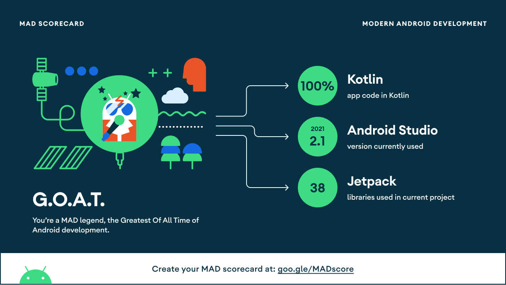

Full details of MAD Score:
- [MAD Score](https://madscorecard.withgoogle.com/scorecards/863589300/)

## 📸 Screenshots
||||
|:----------------------------------------:|:-----------------------------------------:|:-----------------------------------------: |
| 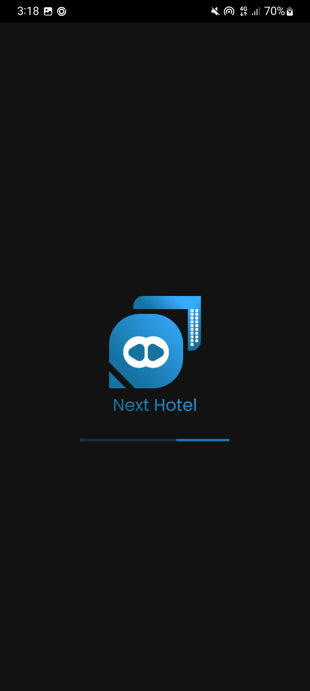 | 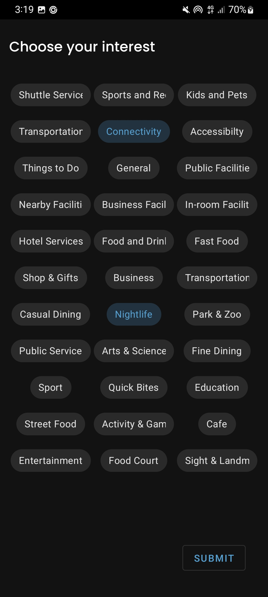 | 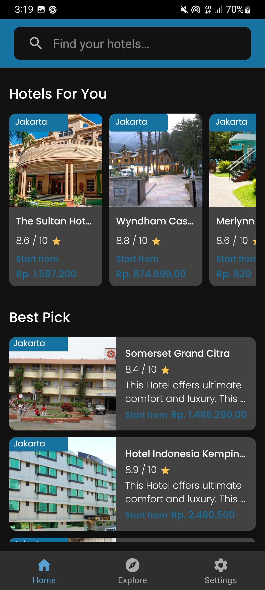 |
| 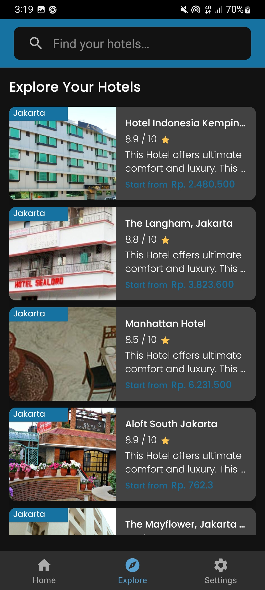 | 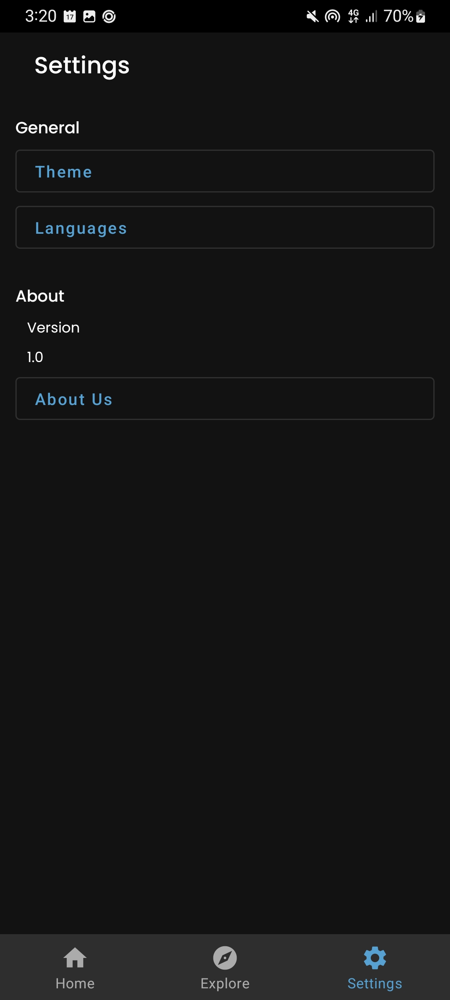 | 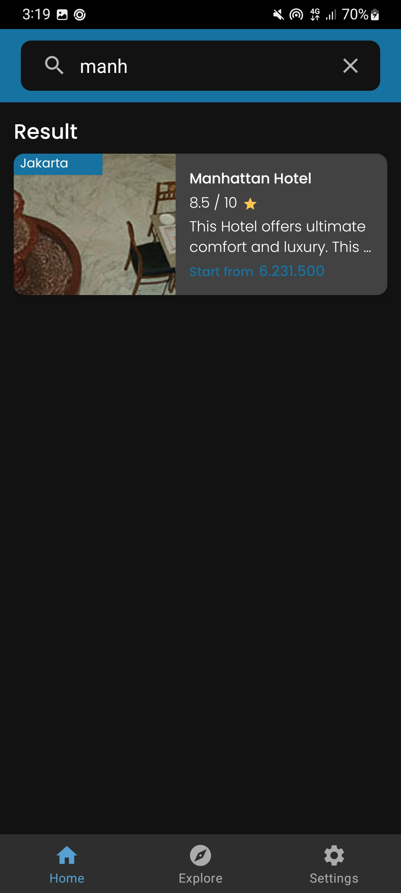 |
| 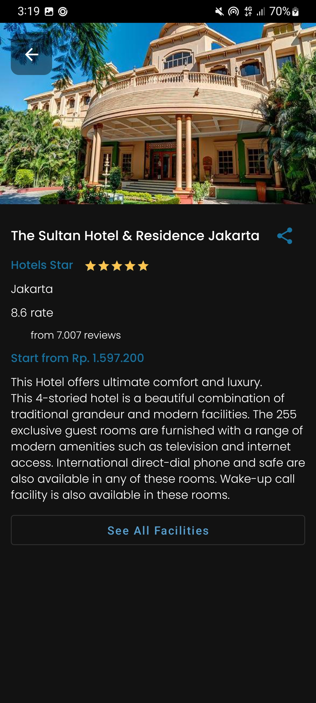 | 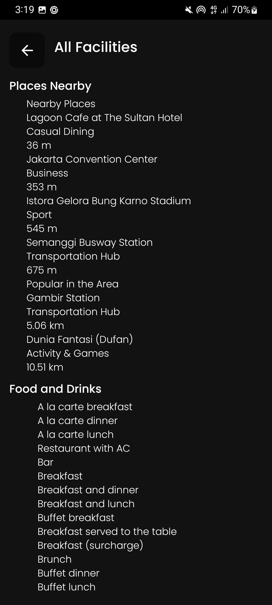 | 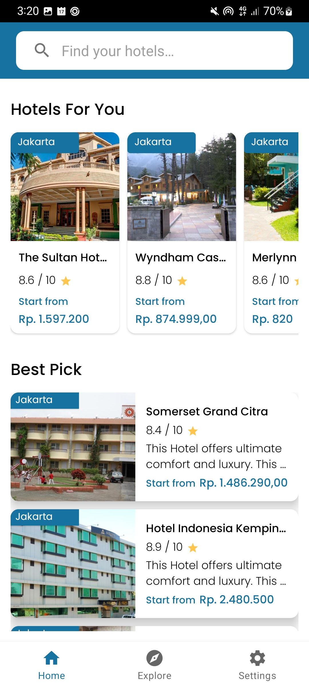 |

## Built With 🛠
- [Kotlin](https://kotlinlang.org/) - First class and official programming language for Android development.
- [Coroutines](https://kotlinlang.org/docs/reference/coroutines-overview.html) - A coroutine is a concurrency design pattern that you can use on Android to simplify code that executes asynchronously.
- [LiveData](https://developer.android.com/topic/libraries/architecture/livedata) -  oOservable data holder class.
- [Android Architecture Components](https://developer.android.com/topic/libraries/architecture) - Collection of libraries that help you design robust, testable, and maintainable apps.
    - [ViewModel](https://developer.android.com/topic/libraries/architecture/viewmodel) - Stores UI-related data that isn't destroyed on UI changes.
    - [ViewBinding](https://developer.android.com/topic/libraries/view-binding) - Generates a binding class for each XML layout file present in that module and allows you to more easily write code that interacts with views.
    - [Data Store](https://developer.android.com/topic/libraries/architecture/datastore) - Data storage solution that allows you to store key-value pairs or typed objects with protocol buffers.
- [Dependency Injection](https://developer.android.com/training/dependency-injection) - A technique widely used in programming and well suited to Android development.
- [Retrofit](https://square.github.io/retrofit/) - A type-safe HTTP client for Android and Java.
- [GSON](https://github.com/google/gson) - A modern JSON library for Kotlin and Java.
- [GSON Converter](https://github.com/square/retrofit/tree/master/retrofit-converters/gson) - A Converter which uses GSON for serialization to and from JSON.
- [Coil](https://github.com/coil-kt/coil) - An image loading library for Android backed by Kotlin Coroutines.
- [Material Components for Android](https://github.com/material-components/material-components-android) - Modular and customizable Material Design UI components for Android.

# Package Structure
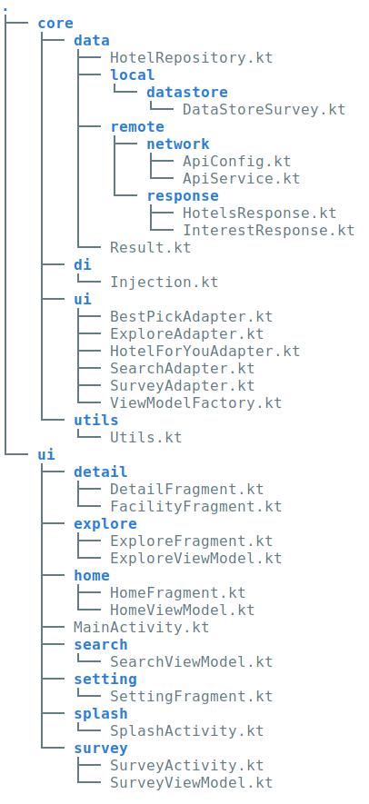
    
## Architecture
This app uses [***MVVM (Model View View-Model)***](https://developer.android.com/jetpack/docs/guide#recommended-app-arch) architecture.

## Contact
Visit:
- [gonexwind git's](https://github.com/gonexwind)
- [Hencya git's](https://github.com/Hencya)
- [Thoriq-ha git's](https://github.com/Thoriq-ha)
